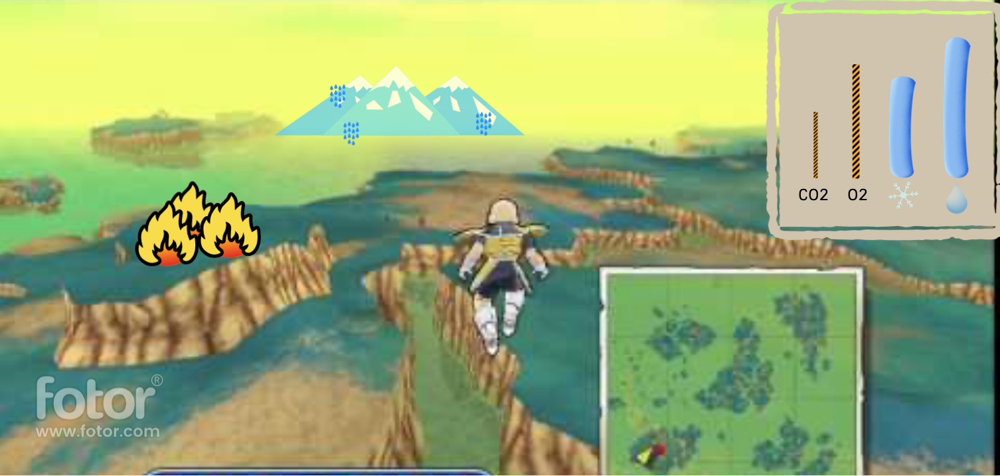

# Planetina

**Come save the world! **

## Concept

In **Planetina** you save the world from environmental hazards and prevent irreversible damages to the planet and its population. You'll need to use your super powers to save the planet from megafires, air pollution, light pollution, low O2 and high CO2 levels etc.  
The player will gain different powers during the game and will need to manage the hazards and resolve them with minimum impact on the planet and the population.

---

## Formal Elements

### 1. Players

* The game is suited for player of ages 7-99 that are looking for a challenge while saving the planet. 
* The game is designed for a single player, but has a leader board. 
* Players will compete to make it to the top of the leader board.

### 2. Goals

* The player’s objectives are to save the planet from all the hazards that he encounters, using his super abilities. The player will win when the planet will be able to take on the environmental hazards without Planetina’s help.
* The player will learn the objectives of the game during the tutorial and the game itself via achievements.
In the tutorial the player will face a complex situation, with multiple hazards taking place, and will be guided through solving them.
* The player won’t be able to change the game’s objectives.

### 3. Processes

* The first 30 second will be of major hazards and the game will guide the player how to save the planet from each of the hazards. The player is using the keyboard to maneuver throw the planet to get to the hazard, once getting to the scene, there will be a mini game of how to resolve the hazard. On each hazard the player will have the option to choose one of 2 solutions, one will be sustainable and the other will be temporary.
* The core of the game: the player is flying in the planet and if there is a hazard there will be an alarm on the top of the screen. Once a hazard has appeared the player can choose to fly to it or not by using the keyboard. 
* The end of the game: in order to win the game the player needs to make must of the solutions he chose be sustainable, the score will be higher for the sustainable solutions.

### 4. Rules

* The player’s actions will be limited by 
* The player’s score will be impacted by the way and speed he resolved the hazards, and by the solution he chose – sustainable solution wi